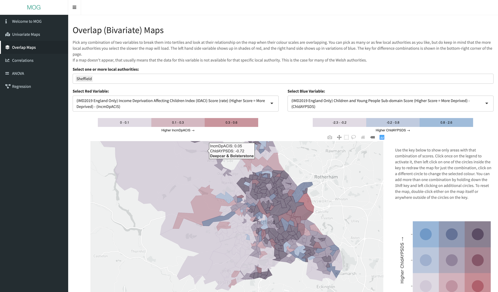
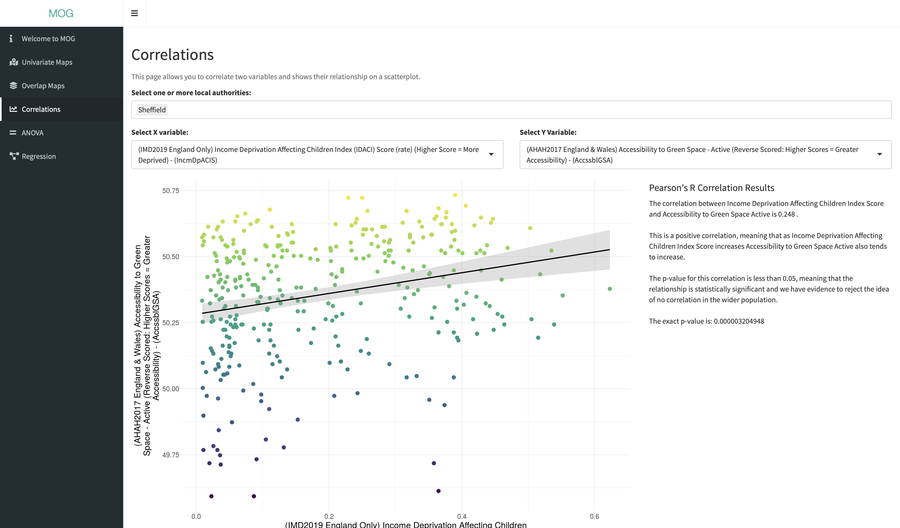

# Mapping Overlaps Gadget: Education
This is the source code and data for the Mapping Overlaps Gadget: Education App. This Shiny App uses a collection of published public data about Lower Super Output Areas in England and Wales, including journey travel time statistics, indices of multiple deprivation, access to healthy habits and hazards, and more. Full details of sources of data and citations for packages that this app relies on are found on the mog_welcome screen.

It is intended to be used by educators for students to learn how to interact with data visualisations and basic models and statistical tests (including multiple linear regression, correlations, and ANOVA). It may also be beneficial for local authority managers, analysts, social workers and community services.

A live version can be loaded through shinyapps.io here: [https://webb.shinyapps.io/MOG_education/](https://webb.shinyapps.io/MOG_education/)

